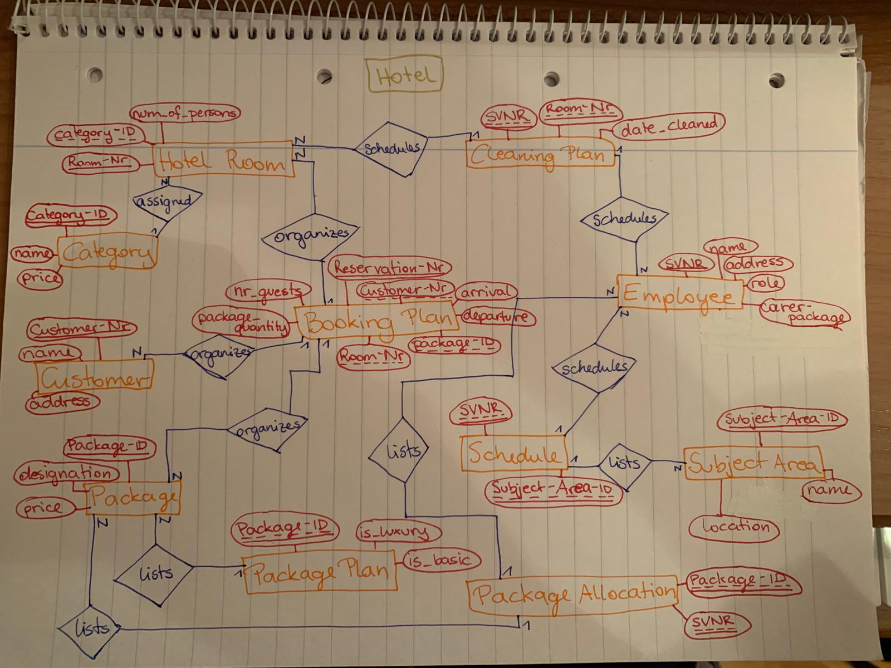
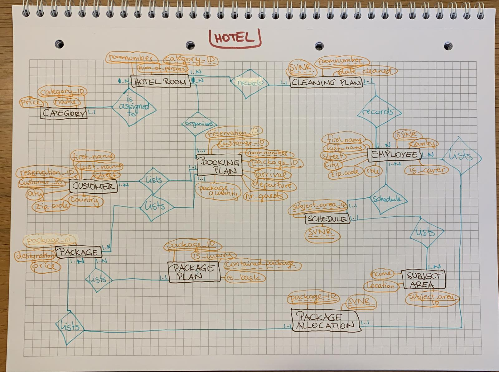

# Hotel-ERM
A database has to be implemented for a hotel business. Draw the following facts in an ER diagram in Chen notation and create a relational model No zero values are allowed. Use the attribute names in brackets.
Hotel rooms are uniquely identified by a number (NUMBER). It is also stored whether it is a single room or a double room (PERSONS). Each room is assigned to a category. Categories have a unique ID (ID) and a description (NAME).
Employees are identified by a unique social security number (SVNR). Name (NAME) and address (ADDRESS) of the employee are also known. Room attendants and caretakers are employees. The system stores which room is cleaned by which room attendant. For caretakers, a subject area (e.g. sauna, masseur, swimming pool, kitchen, ...) is also stored.
A guest has a unique customer number (CustomerNR), a name, (NAME) and an address (ADDRESS). A guest can make several bookings. A booking depends on the room and on a date of arrival (FROM) and departure (TO).
The hotel also offers service packages. A unique designation (DESIGN) and a price (PRICE) are stored. There are basic packages and luxury packages. A luxury package contains at least one or more basic packages. Any number of different service packages can be ordered for each booking, whereby the quantity ( QUANTITY) must also be noted. For each service package, one or more carers are responsible.

## ERM

## Relational Model

* Hotel Room (**roomnumber:int**, *category_ID:int*, num_of_persons:int)
* Category (**category_ID:int**, name:varchar(32), price:double)
* Employee (**SVNR:int**, first_name:varchar(32), last_name:varchar(32), street:varchar(32), city:varchar(32), zip_code:varchar(5), country:varchar(20), role:varchar(32), is_carer:boolean)
* Customer (**customer_ID:int**, *reservation_ID:int*, first_name:varchar(32), last_name:varchar(32), street:varchar(32), city:varchar(32), zip_code:varchar(5), country:varchar(20))
* Cleaning Plan (**_SVNR:int_**, **_roomnumber:int_**, date_cleaned:date)
* Booking Plan (**reservation_ID:int**, _customer_ID:int_, _roomnumber:int_, _package_ID:int_, arrival:date, departure:date, nr_guests:int, package_quantity:int)
* Package (**package_ID:int**, designation:varchar(32), price:double)
* Package Plan (***package_ID:int***, *contained_package:int*, is_luxury:boolean, is_basic:boolean)
* Package Allocation (***package_ID:int***, **_SVNR:int_**)
* Subject Area (**subject_area_ID:int**, name:varchar(32), location:varchar(32))
* Schedule (***SVNR:int***, ***subject_area_ID:int***)
